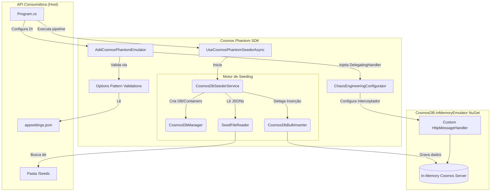
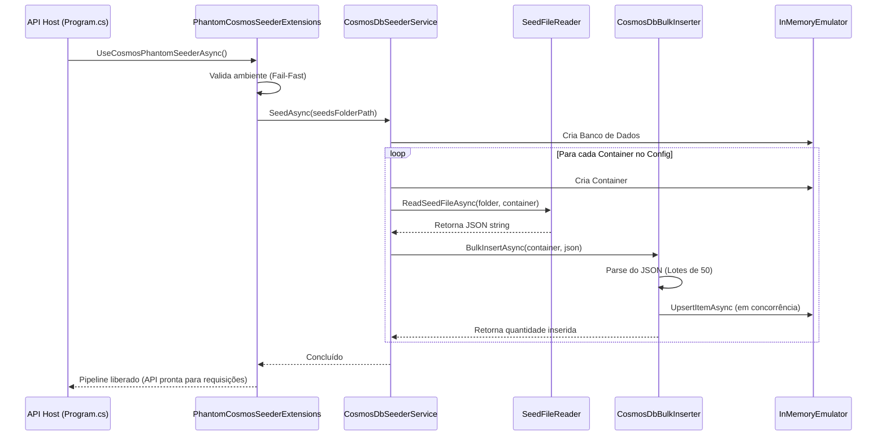
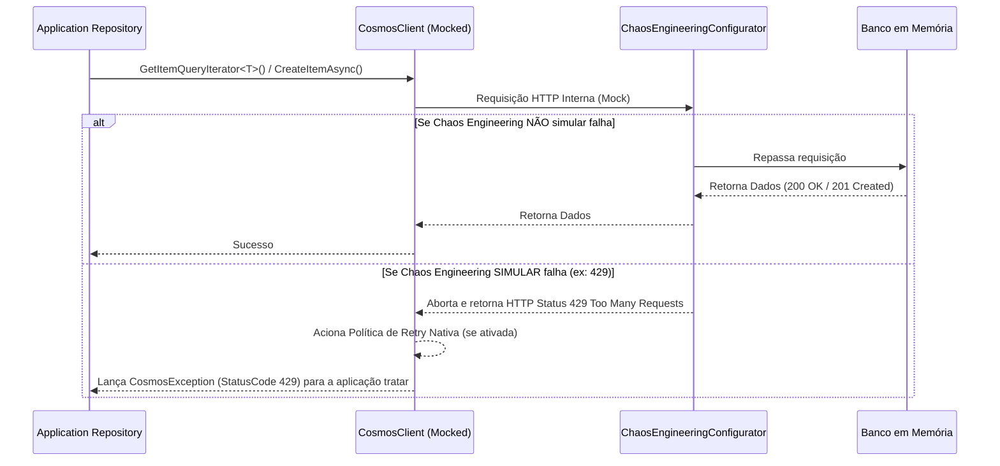

# Arquitetura: Cosmos Phantom SDK

Abaixo, detalhamos a arquitetura do **Cosmos Phantom SDK** em três visões principais.

---

## 1. Visão Geral de Componentes (Diagrama de Fluxo)

Este diagrama mostra as principais peças do SDK e como elas interagem com a Aplicação Principal (Consumer API) e com o pacote base (`CosmosDB.InMemoryEmulator`).

---

## 2. Fluxo de Inicialização e Seeding (Sequence Diagram)

Mostra o comportamento sequencial no momento em que a aplicação "sobe", lendo os arquivos locais e populando a base na memória.

---

## 3. Fluxo em Tempo de Execução e Chaos Engineering

Mostra o que acontece quando a API já está de pé e um repositório da aplicação tenta acessar o banco de dados. O Chaos Engineering atua aqui, interceptando as requisições e injetando falhas para testar a resiliência.

